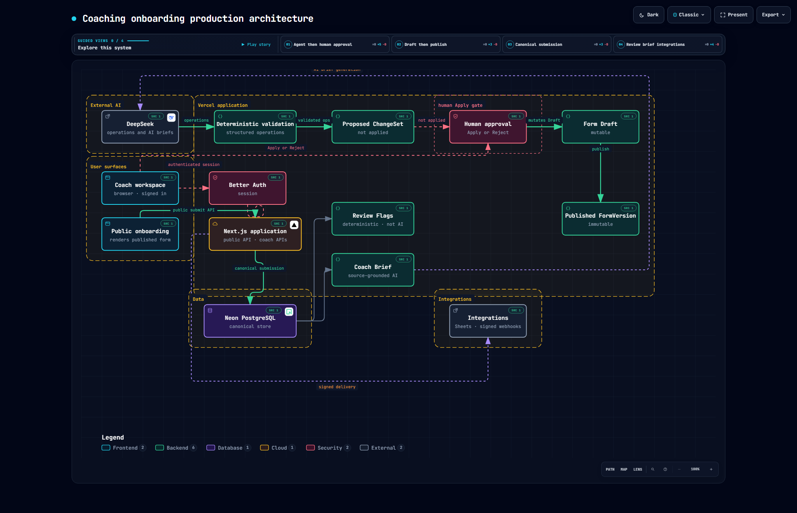

# Coaching

Coaching is an AI-first client onboarding SaaS for fitness coaches.

Coaches describe how they work, then build a schema-driven onboarding form with a human-approved Agent. Clients submit on a public form. Canonical answers land in PostgreSQL. The workspace surfaces deterministic Review Flags, optional source-grounded Coach Briefs, and optional delivery to Google Sheets or signed webhooks.

The LLM never writes the form draft directly. It proposes structured operations. The application validates them. A coach must Apply or Reject before anything mutates.

**Live application:** [https://ai-coaching-onboarding.vercel.app](https://ai-coaching-onboarding.vercel.app)

**Source:** [github.com/Ekpo-Emmanuel/fitness-coaching-onboarding](https://github.com/Ekpo-Emmanuel/fitness-coaching-onboarding)

## Overview

Fitness coaches need intake that is specific to their practice, not a generic questionnaire. Coaching keeps the form as a first-class product object: a mutable draft, an immutable published version, and a public client renderer that shares the same schema.

The product is multi-tenant. Email/password sessions (Better Auth) map to a workspace. Forms, submissions, clients, Agent threads, and integrations are scoped to that workspace.

## Key Capabilities

- **AI-assisted form building** — natural-language requests become proposed operations; Apply/Reject is a coach action
- **Schema-driven forms** — one JSON schema for the builder, preview, and public `/f/[slug]` renderer, including conditional field logic
- **Versioned publishing** — publish snapshots an immutable `FormVersion`; live clients submit against that version
- **Public client onboarding** — unauthenticated submit through the Next.js public API
- **Client and submission review** — original answers, rule-based Review Flags, optional Coach Brief
- **Workspace auth** — Better Auth sessions, coach onboarding, dashboard, forms, clients, settings
- **Google Sheets** — workspace OAuth; submissions appended after canonical storage
- **Signed webhooks** — HMAC-signed payloads, SSRF checks on destination URLs, delivery retry via maintenance

Agent and Coach Brief require `DEEPSEEK_API_KEY`. Sheets and webhooks are optional until configured in Connections.

## Architecture

Production topology (Vercel application, Neon PostgreSQL, DeepSeek, integrations):



[SVG](docs/architecture/coaching-architecture.svg)

Coach workspace and public onboarding are browser surfaces. They talk to the Next.js app over an authenticated session or the public submit API. Neon is the canonical store. Review Flags are deterministic. Coach Briefs are source-grounded generation through DeepSeek. Downstream Sheets/webhook delivery is application logic reading the stored submission — not the database sending events.

The same model in one pass:

- mutable Form Draft vs immutable published FormVersion
- AI-generated structured operations, then deterministic validation, then a Proposed ChangeSet
- mandatory human approval before draft mutation
- canonical PostgreSQL storage
- deterministic Review Flags
- source-grounded AI Coach Briefs
- optional Google Sheets and signed webhook integrations

## Human-Approved AI Architecture

The Agent does not mutate application state.

1. Coach writes a natural-language request in the form builder.
2. DeepSeek returns structured operations (not a raw schema dump).
3. The server parses and validates those operations, then simulates them against the current draft.
4. A Proposed ChangeSet is stored (`status: proposed`) with a summary the coach can read.
5. The coach Applies or Rejects. Only Apply calls `updateDraft`.
6. If the draft revision moved since the proposal, the ChangeSet is superseded and must be regenerated.

This boundary keeps model output out of the live schema until a human accepts a validated proposal. Invalid operations never reach the draft. The form is unchanged on provider failure.

## Engineering Highlights

- **Draft / version split** — editing happens on a revisioned draft; publish writes an immutable `FormVersion` clients actually submit against
- **Structured Agent contract** — operations are parsed and simulated before a ChangeSet exists; Apply re-validates against the current revision
- **Canonical submissions** — public POST goes through Next.js, validates answers against the published schema, then writes Postgres first
- **Idempotent public submit** — `submissionAttemptId` reuses an existing row for the same form version instead of inserting a duplicate
- **Workspace authorization** — form, client, Agent, and integration queries are scoped by `workspaceId`
- **Encrypted integration secrets** — AES-256-GCM envelope for stored OAuth/webhook credentials (`INTEGRATION_ENCRYPTION_KEY`)
- **Webhook hardening** — HMAC SHA-256 signatures (`v1=`), blocked private/metadata hosts, no credentials in webhook URLs
- **Delivery retries** — pending/failed integration deliveries and stale Coach Brief work are processed by `GET/POST /api/internal/maintenance` with `CRON_SECRET`
- **Production headers** — CSP, `X-Frame-Options: DENY`, HSTS in production (`next.config.ts`)
- **Migrations** — Drizzle SQL under `drizzle/`; apply with `npm run db:migrate`

## Tech Stack

**Frontend** — Next.js 16 App Router, React 19, TypeScript, Tailwind CSS 4

**Backend** — Next.js Route Handlers and server modules; Drizzle ORM

**Database** — PostgreSQL on Neon (`@neondatabase/serverless`)

**Authentication** — Better Auth (email/password, Drizzle adapter)

**AI** — DeepSeek (`DEEPSEEK_API_KEY`, default model `deepseek-flash`) for Agent operations and Coach Briefs

**Integrations** — Google Sheets via `googleapis` + OAuth; HMAC-signed HTTPS webhooks

**Infrastructure** — Vercel; Vercel Cron to `/api/internal/maintenance`

**Testing** — Vitest (including PGlite-backed service tests), Playwright (`e2e/`)

## Product Flow

**Coach:** create a form → edit the draft manually or with the Agent → Apply or Reject proposed ChangeSets → publish → share `/f/[slug]`.

**Client:** open the public form → complete onboarding → submit.

**System:** persist the canonical submission → evaluate Review Flags → optionally generate a Coach Brief → optionally enqueue Sheets/webhook deliveries.

## Running Locally

Prerequisites: Node.js 20.9 or newer, a PostgreSQL database (Neon is what production uses).

```bash
npm install
cp .env.example .env.local
```

Set at least the required variables in `.env.local` (see below). Generate distinct secrets:

```bash
openssl rand -hex 32
```

Use separate values for `BETTER_AUTH_SECRET`, `INTEGRATION_ENCRYPTION_KEY`, and `CRON_SECRET`. Set `BETTER_AUTH_URL=http://localhost:3000`. Prefer `sslmode=verify-full` on `DATABASE_URL`.

```bash
npm run db:migrate
npm run dev
```

Open `/signup`. Agent and Coach Brief need `DEEPSEEK_API_KEY`. Sheets need Google OAuth client credentials.

Do not put secrets in `NEXT_PUBLIC_*` variables.

## Environment Variables

Canonical list: [`.env.example`](.env.example). Names and purposes only.

**Required**

| Variable | Purpose |
| --- | --- |
| `DATABASE_URL` | Postgres connection (Neon in production) |
| `BETTER_AUTH_SECRET` | Session signing secret |
| `BETTER_AUTH_URL` | Public origin, no trailing slash |
| `INTEGRATION_ENCRYPTION_KEY` | AES-256-GCM key for stored integration secrets |
| `CRON_SECRET` | Bearer token for `/api/internal/maintenance` |

`TRUST_PROXY` is treated as true when `NODE_ENV=production`. Set it if you terminate TLS in front of a non-production Node host.

**AI (required for Agent and Coach Brief)**

| Variable | Purpose |
| --- | --- |
| `DEEPSEEK_API_KEY` | DeepSeek API key |
| `DEEPSEEK_MODEL` | Defaults to `deepseek-flash` |
| `DEEPSEEK_BASE_URL` | Defaults to `https://api.deepseek.com` |
| `DEEPSEEK_COACH_BRIEF_MODEL` | Optional override; otherwise uses `DEEPSEEK_MODEL` |

**Google Sheets (required only if Connections uses Sheets)**

| Variable | Purpose |
| --- | --- |
| `GOOGLE_OAUTH_CLIENT_ID` | OAuth web client |
| `GOOGLE_OAUTH_CLIENT_SECRET` | OAuth web client secret |
| `GOOGLE_OAUTH_REDIRECT_URI` | Defaults to `{BETTER_AUTH_URL}/api/integrations/google/callback` |

**Optional / development** — `GEMINI_*`, `OPENAI_*`, Playwright/live-test helpers, and legacy V1 Sheets service-account variables are listed in `.env.example`. They are not required for the current product path (`/` is the SaaS landing page; clients use `/f/[slug]`).

## Testing

```bash
npm run lint
npm test
npx playwright install
npm run test:e2e
```

`npm test` runs Vitest. `npm run test:e2e` runs Playwright against `http://127.0.0.1:3000` (starts `npm run dev` unless a server is already running).

Live scripts (`npm run test:agent-live`, `test:coach-brief-live`, `test:google-destination-live`, `test:webhook-live`) call real providers. They need keys in `.env.local` and are not part of the default suite.

## Deployment

Production is the Next.js app on Vercel with Neon PostgreSQL.

Required Vercel env: `DATABASE_URL`, `BETTER_AUTH_SECRET`, `BETTER_AUTH_URL` (the public `https://` origin), `INTEGRATION_ENCRYPTION_KEY`, `CRON_SECRET`.

Add `DEEPSEEK_API_KEY` for Agent/Briefs and Google OAuth vars for Sheets. After the domain is known, set `BETTER_AUTH_URL` and the Google redirect URI `{BETTER_AUTH_URL}/api/integrations/google/callback`.

Apply migrations to the production database (`npm run db:migrate` against that `DATABASE_URL`) after a Neon snapshot. Do not edit SQL files that have already been applied.

`vercel.json` schedules `GET /api/internal/maintenance` daily (`0 0 * * *`). Vercel Cron sends `Authorization: Bearer $CRON_SECRET`. Hobby plans may not support a denser schedule; an external caller can `POST` the same path.

`GET /api/health` returns `{ "ok": true }` when the app is up.

Launch checklist: [`PRODUCTION_CHECKLIST.md`](PRODUCTION_CHECKLIST.md).

## Security notes

Implemented in this repo, not a completeness claim:

- Workspace-scoped reads and writes
- Encrypted integration credentials
- HMAC-signed webhooks and SSRF checks on webhook hosts
- Idempotent public submit via `submissionAttemptId`
- Payload size / honeypot / timing checks on public submit; per-instance rate limiter (not a global WAF)
- Security headers including CSP
- Maintenance endpoint requires `CRON_SECRET`
- `/dev/*` returns 404 in production

Client answers belong to the workspace. Do not commit `.env.local`. Rotate any secret that has been pasted into chat or committed.
